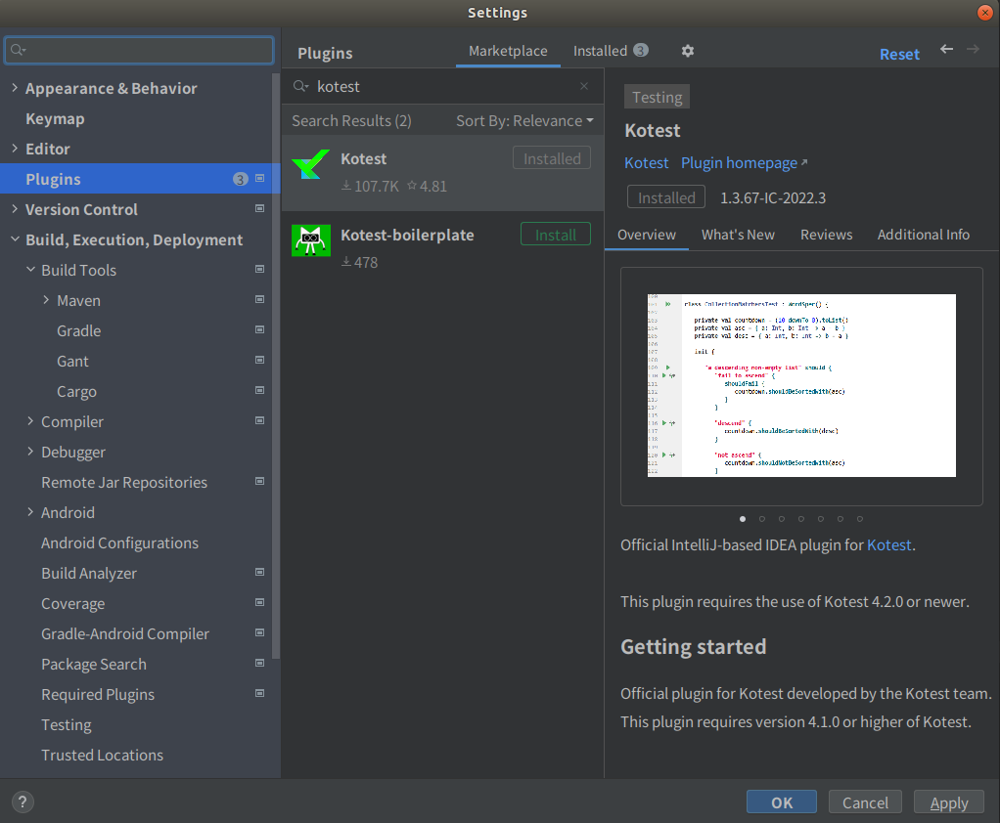
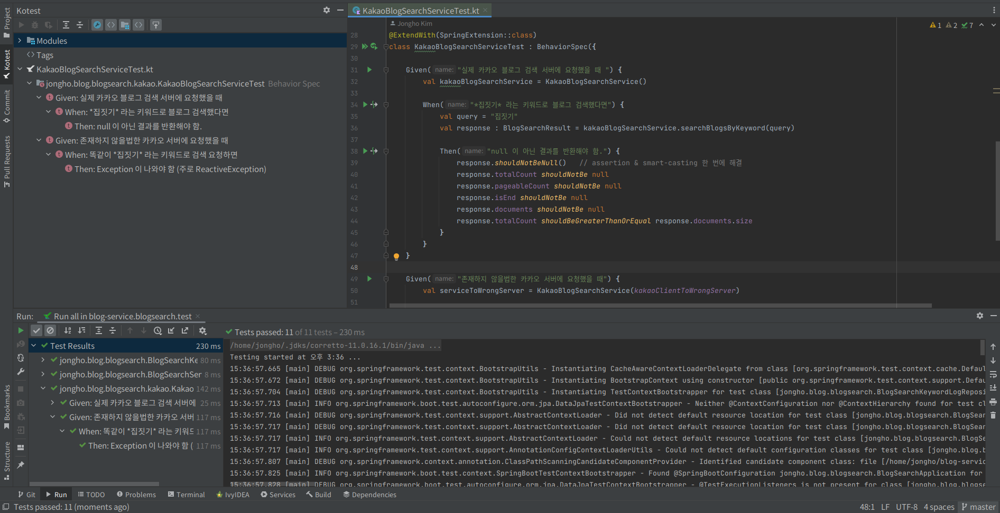

블로그 서비스
======
# 프로젝트 목표
Kotlin + Spring Boot 를 익히기 위해 간단한 Toy Project 작성

# 주요 기능
## \[기능1\] 블로그 검색
- `blog-search` 모듈에 서비스를 구현함
- 키워드를 통해 블로그 검색
- 검색결과는 정확도순, 최신수정날짜순으로 정렬 가능
- 검색결과는 페이지 단위
- 데이터는 [카카오 블로그 검색 API](https://developers.kakao.com/docs/latest/ko/daum-search/dev-guide#search-blog) 를 이용하여 제공
- (*Kakao Authorization Key 암호화* )

## \[기능2\] 인기 검색어
- 아직 구현하지 못함
- ~~`blog-search` 모듈에 서비스를 구현함~~
- ~~[기능1] 블로그 검색 서비스에서 사용자들이 입력한 키워드 중 인기가 많은 검색어들을 추려줌~~

# 배포
1. GitHub 를 통한 소스코드 공개

2. JAR 파일 다운로드 받고 해당 JAR 파일을 실행하면 애플리케이션 실행됨
   - [Google Drive 에서 jar 파일 다운로드 받기](https://drive.google.com/file/d/1osNDt_I_JBGY5POmkB2Hh5cuLztGmZyD/view?usp=share_link)
   - [Dropbox 에서 jar 파일 다운로드 받기](https://www.dropbox.com/s/sfybwnn5lm5urur/blog-service-0.0.1-SNAPSHOT.jar?dl=0)

혹시 다운로드가 안 된다면, 소스코드가 있는 이 프로젝트 리포지토리에서 아래 명령어를 수행하여 만들면 된다.   
shell 변수 `$PATH_TO_THIS_PROJECT` 와  `$LOCATION_YOU_WANT` 에는 원하는 값을 알맞게 넣어주어야 한다!!
```shell
cd $PATH_TO_THIS_PROJECT
gradle :bootJar
mv build/libs/blog-service-0.0.1-SNAPSHOT.jar $LOCATION_YOU_WANT
```

# 사용법 및 테스트 방법
간단히 소개하면 아래와 같다.   
* API 명세
* 서버 실행방법:
  - 실행방법1: JAR 파일 실행
  - 실행방법2: Gradle 활용한 서버 실행
* 요청 및 응답 확인방법:
  - 요청 및 응답 확인 방법1: curl 사용
  - 요청 및 응답 확인 방법2: Swagger UI 활용하여 웹 브라우저에서 확인
* 유닛 테스트 실행방법:
  - 유닛 테스트 실행방법1: Gradle 활용한 유닛 테스트 실행
  - 유닛 테스트 실행방법2: IntelliJ 및 Kotest 플러그인 활용

## API 명세
```text
GET /v1/blog/search
Host: localhost:8080
```

| Parameter Name | Desription                      | Required/Optional | Type    | Default Value   | Available Value    |
|----------------|---------------------------------|-------------------|---------|-----------------|--------------------|
| `query`        | 블로그 검색에 사용할 키워드           | 필수                | String  | 없음            | 모두 가능            |                                                  
| `sort`         | 정렬 방식. 최신순, 정확도로 정렬 가능  | 선택                | String  | ACCURACY        | ACCURACY / RECENCY | 
| `page`         | 검색결과에서 페이지 번호             | 선택                | Integer | 1               | 1-50               |
| `size`         | 페이지 당 들어갈 검색결과 갯수        | 선택                | Integer | 50              | 1-50               |

## 실행방법1: JAR 파일 실행
다운로드한 JAR 파일 실행하여 서버 애플리케이션 실행:
```shell
java -jar blog-service-0.0.1-SNAPSHOT.jar
```

## 실행방법2: Gradle 활용한 서버 실행
미리 프로젝트 디렉토리에 진입한 상태여야 한다.
```shell
cd $PATH_TO_THIS_PROJECT
```

아래와 같이 실행한다.
```shell
gradle :bootRun
```

## 요청 및 응답 확인 방법1: curl 사용
shell 기반 CLI 툴인 curl 을 사용하여 요청을 보낸다.   

요청 예시1:
```shell
curl -v -X GET "localhost:8080/v1/blog/search" \
 -H "Content-Type: application/x-www-form-urlencoded" \
 --data-urlencode "query=house"
```

요청 예시2:
```shell
curl -v -X GET "localhost:8080/v1/blog/search/keyword/house" \
 --data "size=60"
```

요청 예시2 의 경우, size가 50을 넘으므로 HTTP 400 Bad Request 가 반환될 것이다.

요청 예시3:
```text
curl -v -X GET "localhost:8080/v1/blog/search/keyword/my_house" \
--data-urlencode "query=my_house" \
--data "sort=recency" \
--data "page=1" \
--data "size=50"
```

## 유닛 테스트 실행방법1: Gradle 활용한 유닛 테스트 실행
미리 프로젝트 디렉토리에 진입한 상태여야 한다.
```shell
cd $PATH_TO_THIS_PROJECT
```

예를 들어, 만약 Kotest 를 활용하여 `jongho.blog.blogsearch.kakao.KakaoBlogSearchServiceTest` 라는 클래스를 테스트하고 싶다면, 아래와 같이 실행한다.
```shell
gradle :blog-search:kotest --tests "jongho.blog.blogsearch.kakao.KakaoBlogSearchServiceTest"
```

결과는 아래와 같이 나온다 (유닛 테스트이므로, Hiberate 에서 생성한 SQL도 출력하게 함): 
<details>
  <summary>결과 메세지 보기</summary>

### 결과 메세지
```text
> Task :blog-search:compileKotlin
w: file:///home/jongho/blog-service/blog-search/src/main/kotlin/jongho/blog/blogsearch/kakao/KakaoBlogSearchService.kt:47:39 The corresponding parameter in the supertype 'BlogSearchApi' is named 'query'. This may cause problems when calling this function with named arguments.

> Task :blog-search:compileTestKotlin
w: file:///home/jongho/blog-service/blog-search/src/test/kotlin/jongho/blog/blogsearch/BlogSearchKeywordLogRepositoryTest.kt:95:13 Variable 'keyword2' is never used
w: file:///home/jongho/blog-service/blog-search/src/test/kotlin/jongho/blog/blogsearch/BlogSearchKeywordLogRepositoryTest.kt:96:13 Variable 'keyword3' is never used

> Task :blog-search:kotest
io.kotest.engine.reporter.TaycanConsoleReporter
java.lang.ClassNotFoundException: io.kotest.engine.reporter.TaycanConsoleReporter
at java.base/jdk.internal.loader.BuiltinClassLoader.loadClass(BuiltinClassLoader.java:581)
at java.base/jdk.internal.loader.ClassLoaders$AppClassLoader.loadClass(ClassLoaders.java:178)
at java.base/java.lang.ClassLoader.loadClass(ClassLoader.java:522)
at java.base/java.lang.Class.forName0(Native Method)
at java.base/java.lang.Class.forName(Class.java:315)
at io.kotest.engine.launcher.ConsoleKt.createConsoleListener(console.kt:21)
at io.kotest.engine.launcher.MainKt.main(main.kt:30)
>> Kotest
- I test code and chew bubblegum, and I'm all out of bubblegum
- Test plan has 3 specs

1.  jongho.blog.blogsearch.BlogSearchKeywordLogRepositoryTest
    19:25:25.722 [main @coroutine#2] DEBUG org.springframework.test.context.BootstrapUtils - Instantiating CacheAwareContextLoaderDelegate from class [org.springframework.test.context.cache.DefaultCacheAwareContextLoaderDelegate]
    19:25:25.729 [main @coroutine#2] DEBUG org.springframework.test.context.BootstrapUtils - Instantiating BootstrapContext using constructor [public org.springframework.test.context.support.DefaultBootstrapContext(java.lang.Class,org.springframework.test.context.CacheAwareContextLoaderDelegate)]
    19:25:25.760 [main @coroutine#2] DEBUG org.springframework.test.context.BootstrapUtils - Instantiating TestContextBootstrapper for test class [jongho.blog.blogsearch.BlogSearchKeywordLogRepositoryTest] from class [org.springframework.boot.test.autoconfigure.orm.jpa.DataJpaTestContextBootstrapper]
    19:25:25.769 [main @coroutine#2] INFO org.springframework.boot.test.autoconfigure.orm.jpa.DataJpaTestContextBootstrapper - Neither @ContextConfiguration nor @ContextHierarchy found for test class [jongho.blog.blogsearch.BlogSearchKeywordLogRepositoryTest], using SpringBootContextLoader
    19:25:25.773 [main @coroutine#2] DEBUG org.springframework.test.context.support.AbstractContextLoader - Did not detect default resource location for test class [jongho.blog.blogsearch.BlogSearchKeywordLogRepositoryTest]: class path resource [jongho/blog/blogsearch/BlogSearchKeywordLogRepositoryTest-context.xml] does not exist
    19:25:25.773 [main @coroutine#2] DEBUG org.springframework.test.context.support.AbstractContextLoader - Did not detect default resource location for test class [jongho.blog.blogsearch.BlogSearchKeywordLogRepositoryTest]: class path resource [jongho/blog/blogsearch/BlogSearchKeywordLogRepositoryTestContext.groovy] does not exist
    19:25:25.773 [main @coroutine#2] INFO org.springframework.test.context.support.AbstractContextLoader - Could not detect default resource locations for test class [jongho.blog.blogsearch.BlogSearchKeywordLogRepositoryTest]: no resource found for suffixes {-context.xml, Context.groovy}.
    19:25:25.773 [main @coroutine#2] INFO org.springframework.test.context.support.AnnotationConfigContextLoaderUtils - Could not detect default configuration classes for test class [jongho.blog.blogsearch.BlogSearchKeywordLogRepositoryTest]: BlogSearchKeywordLogRepositoryTest does not declare any static, non-private, non-final, nested classes annotated with @Configuration.
    19:25:25.859 [main @coroutine#2] DEBUG org.springframework.context.annotation.ClassPathScanningCandidateComponentProvider - Identified candidate component class: file [/home/jongho/blog-service/blog-search/build/classes/kotlin/main/jongho/blog/blogsearch/BlogSearchApplication.class]
    19:25:25.875 [main @coroutine#2] INFO org.springframework.boot.test.context.SpringBootTestContextBootstrapper - Found @SpringBootConfiguration jongho.blog.blogsearch.BlogSearchApplication for test class jongho.blog.blogsearch.BlogSearchKeywordLogRepositoryTest
    19:25:25.878 [main @coroutine#2] DEBUG org.springframework.boot.test.autoconfigure.orm.jpa.DataJpaTestContextBootstrapper - @TestExecutionListeners is not present for class [jongho.blog.blogsearch.BlogSearchKeywordLogRepositoryTest]: using defaults.
    19:25:25.878 [main @coroutine#2] INFO org.springframework.boot.test.autoconfigure.orm.jpa.DataJpaTestContextBootstrapper - Loaded default TestExecutionListener class names from location [META-INF/spring.factories]: [org.springframework.boot.test.autoconfigure.restdocs.RestDocsTestExecutionListener, org.springframework.boot.test.autoconfigure.web.client.MockRestServiceServerResetTestExecutionListener, org.springframework.boot.test.autoconfigure.web.servlet.MockMvcPrintOnlyOnFailureTestExecutionListener, org.springframework.boot.test.autoconfigure.web.servlet.WebDriverTestExecutionListener, org.springframework.boot.test.autoconfigure.webservices.client.MockWebServiceServerTestExecutionListener, org.springframework.boot.test.mock.mockito.MockitoTestExecutionListener, org.springframework.boot.test.mock.mockito.ResetMocksTestExecutionListener, org.springframework.test.context.web.ServletTestExecutionListener, org.springframework.test.context.support.DirtiesContextBeforeModesTestExecutionListener, org.springframework.test.context.event.ApplicationEventsTestExecutionListener, org.springframework.test.context.support.DependencyInjectionTestExecutionListener, org.springframework.test.context.support.DirtiesContextTestExecutionListener, org.springframework.test.context.transaction.TransactionalTestExecutionListener, org.springframework.test.context.jdbc.SqlScriptsTestExecutionListener, org.springframework.test.context.event.EventPublishingTestExecutionListener]
    19:25:25.889 [main @coroutine#2] INFO org.springframework.boot.test.autoconfigure.orm.jpa.DataJpaTestContextBootstrapper - Using TestExecutionListeners: [org.springframework.test.context.web.ServletTestExecutionListener@1e6cc850, org.springframework.test.context.support.DirtiesContextBeforeModesTestExecutionListener@7e7f0f0a, org.springframework.test.context.event.ApplicationEventsTestExecutionListener@7ec58feb, org.springframework.boot.test.mock.mockito.MockitoTestExecutionListener@1dbb650b, org.springframework.boot.test.autoconfigure.SpringBootDependencyInjectionTestExecutionListener@656d10a4, org.springframework.test.context.support.DirtiesContextTestExecutionListener@63ec445c, org.springframework.test.context.transaction.TransactionalTestExecutionListener@3104351d, org.springframework.test.context.jdbc.SqlScriptsTestExecutionListener@77d18d0b, org.springframework.test.context.event.EventPublishingTestExecutionListener@7a344b65, org.springframework.boot.test.autoconfigure.restdocs.RestDocsTestExecutionListener@7b7b3edb, org.springframework.boot.test.autoconfigure.web.client.MockRestServiceServerResetTestExecutionListener@6b474074, org.springframework.boot.test.autoconfigure.web.servlet.MockMvcPrintOnlyOnFailureTestExecutionListener@108531c2, org.springframework.boot.test.autoconfigure.web.servlet.WebDriverTestExecutionListener@48b22fd4, org.springframework.boot.test.autoconfigure.webservices.client.MockWebServiceServerTestExecutionListener@6a9d5dff, org.springframework.boot.test.mock.mockito.ResetMocksTestExecutionListener@3b08f438]

.   ____          _            __ _ _
/\\ / ___'_ __ _ _(_)_ __  __ _ \ \ \ \
( ( )\___ | '_ | '_| | '_ \/ _` | \ \ \ \
\\/  ___)| |_)| | | | | || (_| |  ) ) ) )
'  |____| .__|_| |_|_| |_\__, | / / / /
=========|_|==============|___/=/_/_/_/
:: Spring Boot ::                (v2.7.9)

2023-03-22 19:25:26.219  INFO 16283 --- [in @coroutine#2] j.b.b.BlogSearchKeywordLogRepositoryTest : Starting BlogSearchKeywordLogRepositoryTest using Java 11.0.18 on jongho-B365M-D3H with PID 16283 (/home/jongho/blog-service/blog-search/build/classes/kotlin/test started by jongho in /home/jongho/blog-service/blog-search)
2023-03-22 19:25:26.220  INFO 16283 --- [in @coroutine#2] j.b.b.BlogSearchKeywordLogRepositoryTest : The following 1 profile is active: "test"
2023-03-22 19:25:26.228  WARN 16283 --- [in @coroutine#2] o.s.b.c.config.ConfigDataEnvironment     : Property 'spring.profiles' imported from location 'class path resource [application-test.yml]' is invalid and should be replaced with 'spring.config.activate.on-profile' [origin: class path resource [application-test.yml] - 1:18]
2023-03-22 19:25:26.427  INFO 16283 --- [in @coroutine#2] .s.d.r.c.RepositoryConfigurationDelegate : Bootstrapping Spring Data JPA repositories in DEFAULT mode.
2023-03-22 19:25:26.540  INFO 16283 --- [in @coroutine#2] .s.d.r.c.RepositoryConfigurationDelegate : Finished Spring Data repository scanning in 108 ms. Found 1 JPA repository interfaces.
2023-03-22 19:25:26.572  INFO 16283 --- [in @coroutine#2] beddedDataSourceBeanFactoryPostProcessor : Replacing 'dataSource' DataSource bean with embedded version
2023-03-22 19:25:26.726  INFO 16283 --- [in @coroutine#2] o.s.j.d.e.EmbeddedDatabaseFactory        : Starting embedded database: url='jdbc:h2:mem:fdd712cb-f864-4577-b287-d7f22195ac1e;DB_CLOSE_DELAY=-1;DB_CLOSE_ON_EXIT=false', username='sa'
2023-03-22 19:25:26.969  INFO 16283 --- [in @coroutine#2] o.hibernate.jpa.internal.util.LogHelper  : HHH000204: Processing PersistenceUnitInfo [name: default]
2023-03-22 19:25:26.998  INFO 16283 --- [in @coroutine#2] org.hibernate.Version                    : HHH000412: Hibernate ORM core version 5.6.15.Final
2023-03-22 19:25:27.103  INFO 16283 --- [in @coroutine#2] o.hibernate.annotations.common.Version   : HCANN000001: Hibernate Commons Annotations {5.1.2.Final}
2023-03-22 19:25:27.174  INFO 16283 --- [in @coroutine#2] org.hibernate.dialect.Dialect            : HHH000400: Using dialect: org.hibernate.dialect.H2Dialect
2023-03-22 19:25:27.487  INFO 16283 --- [in @coroutine#2] o.h.e.t.j.p.i.JtaPlatformInitiator       : HHH000490: Using JtaPlatform implementation: [org.hibernate.engine.transaction.jta.platform.internal.NoJtaPlatform]
2023-03-22 19:25:27.493  INFO 16283 --- [in @coroutine#2] j.LocalContainerEntityManagerFactoryBean : Initialized JPA EntityManagerFactory for persistence unit 'default'
2023-03-22 19:25:27.904  INFO 16283 --- [in @coroutine#2] j.b.b.BlogSearchKeywordLogRepositoryTest : Started BlogSearchKeywordLogRepositoryTest in 1.995 seconds (JVM running for 5.153)
Hibernate:
select
count(*) as col_0_0_
from
keyword_log blogsearch0_
+ 영어 데이터 먼저 테스트
  Hibernate:
  select
  count(*) as col_0_0_
  from
  keyword_log blogsearch0_
  where
  blogsearch0_.keyword=?
  - 영어 keyword 검색기록 존재여부 찾기 OK
    Hibernate:
    select
    blogsearch0_.keyword as keyword1_0_0_,
    blogsearch0_.search_count as search_c2_0_0_
    from
    keyword_log blogsearch0_
    where
    blogsearch0_.keyword=?
  - 영어 keyword 가 검색된 횟수 조회 OK
+ 한글 데이터 테스트
  Hibernate:
  select
  count(*) as col_0_0_
  from
  keyword_log blogsearch0_
  where
  blogsearch0_.keyword=?
  Hibernate:
  select
  count(*) as col_0_0_
  from
  keyword_log blogsearch0_
  where
  blogsearch0_.keyword=?
  - 한글 keyword 검색기록 존재여부 찾기 OK
    Hibernate:
    select
    blogsearch0_.keyword as keyword1_0_0_,
    blogsearch0_.search_count as search_c2_0_0_
    from
    keyword_log blogsearch0_
    where
    blogsearch0_.keyword=?
    Hibernate:
    select
    blogsearch0_.keyword as keyword1_0_0_,
    blogsearch0_.search_count as search_c2_0_0_
    from
    keyword_log blogsearch0_
    where
    blogsearch0_.keyword=?
  - 한글 keyword 가 검색된 횟수 조회 OK
+ 한글+특수문자 데이터 테스트
  Hibernate:
  select
  count(*) as col_0_0_
  from
  keyword_log blogsearch0_
  where
  blogsearch0_.keyword=?
  - 한글+특수문자 keyword 검색기록 존재여부 찾기 OK
    Hibernate:
    select
    blogsearch0_.keyword as keyword1_0_0_,
    blogsearch0_.search_count as search_c2_0_0_
    from
    keyword_log blogsearch0_
    where
    blogsearch0_.keyword=?
  - 검색기록이 존재하지 않는 한글+특수문자 keyword 가 검색된 횟수 조회 OK
+ repository에 명시한 함수 테스트
  Hibernate:
  select
  blogsearch0_.keyword as keyword1_0_,
  blogsearch0_.search_count as search_c2_0_
  from
  keyword_log blogsearch0_
  where
  blogsearch0_.keyword=?
  - findByKeyword() 테스트 OK

2.  jongho.blog.blogsearch.BlogSearchServiceTest
- 잘못된 size 로 블로그 검색 요청할 때 OK
- 잘못된 page 로 블로그 검색 요청할 때 OK

3.  jongho.blog.blogsearch.kakao.KakaoBlogSearchServiceTest
+ Given: 실제 카카오 블로그 검색 서버에 요청했을 때
  + When: *집짓기* 라는 키워드로 블로그 검색했다면
    - Then: null 이 아닌 결과를 반환해야 함. OK
+ Given: 존재하지 않을법한 카카오 서버에 요청했을 때
  + When: 똑같이 *집짓기* 라는 키워드로 검색 요청하면
    - Then: Exception 이 나와야 함 (주로 ReactiveException) OK

>> All tests passed

Specs:   3 passed, 0 failed, 3 total
Tests:   11 passed, 0 failed, 0 ignored, 11 total
Time:    6s
2023-03-22 19:25:29.045  INFO 16283 --- [ionShutdownHook] j.LocalContainerEntityManagerFactoryBean : Closing JPA EntityManagerFactory for persistence unit 'default'

Deprecated Gradle features were used in this build, making it incompatible with Gradle 8.0.

You can use '--warning-mode all' to show the individual deprecation warnings and determine if they come from your own scripts or plugins.

See https://docs.gradle.org/7.1.1/userguide/command_line_interface.html#sec:command_line_warnings

BUILD SUCCESSFUL in 8s
4 actionable tasks: 4 executed
```

</details>


## 유닛 테스트 실행방법2: IntelliJ 및 Kotest 플러그인 활용
IntelliJ 를 사용하는 유저라면, Kotest 플러그인을 활용할 수 있다.
아래와 같이 Kotest 에서 제작한 Kotest Plugin for IntellijJ 를 설치하자.


설치 전 IntelliJ 화면 좌측 바는 아래와 같다:      


설치 후 IntelliJ 화면 우측 바에 Kotest 항목이 추가된 것을 확인할 수 있다:   


예를 들어, `jongho.blog.blogsearch.kakao.KakaoBlogSearchServiceTest` 라는 클래스를 테스트하고 싶다면,   
아래와 같은 실행화면을 볼 수 있다.   
Kotest 에서 정의한 `Given`-`When`-`Then`이 구조화되어 화면에 보이는 것을 확인할 수 있다!


# 사용한 기술 및 오픈소스 라이브러리
Spring Boot 를 포함하여 오픈소스 라이브러리/프레임워크만 사용함
* 핵심 언어/기술/라이브러리:
  - **Kotlin (compatible with Java 11)**
  - **Gradle Kotlin DSL**
  - **Spring Boot 2.7.9**
* 파싱
  - Jackson extension for Kotlin `jackson-module-kotlin`
* 유닛 테스트
  - JUnit
* Kotlin 언어의 장점을 활용한 유닛 테스트
  - Kotest
  - Kotest spring extension: Spring annotation (@Autowired 등) 과 함께 사용하여 테스트하기 위해 사용
  - MockK
* DBMS & JPA
  - H2
  - Hibernate
* 이외 dependency 들은 `build.gradle.kts` 에서 확인
* 오픈소스가 아닌 라이브러리는 사용하지 않음

## 유닛 테스트: JUnit
## Kotlin 언어의 장점을 활용한 유닛 테스트: Kotest, MockK
JUnit 등 라이브러리만 사용하여도 되지만, Kotlin 이 가지는 특징/장점인 함수형 표현식을 적극적으로 활용하는 라이브러리를 사용하였다.

# 고려사항
* **Multi-module Project**

* **Test Case**

* **예외 처리 (Exception Handling)**

* TODO: 트래픽이 많을 시 많은 데이터를 처리하기: 트래픽이 많을 경우를 대비하여, 검색의 경우는 read-only transaction 임 을감안하여

* TODO: **동시성 이슈** (예: ***인기 검색어**가 검색된 횟수* 의 정확도)

* TODO: 카카오 블로그 검색 API 에 장애가 발생한 경우, [네이버 블로그 검색 API](https://developers.naver.com/docs/serviceapi/search/blog/blog.md) 를 통해 데이터 제공

## 고려사항: Multi-module Project
- 이 프로젝트는 현재 독립적인 2개의 모듈로 구성되어 있다: `:blog-service-core`, `:blog-search`
- 각 모듈들은 `build.gradle.kts` 에 dependency 를 정의하여, 각 모듈에 문제
- root project 는 아무런 설정파일이나 소스코드를 가지고 있지 않다. 즉, `src` 디렉토리나 `application.yml` 등의 파일을 가지고 있지 않다.
- `gradle :bootJar` 를 수행하면 root project 가 subproject 인 두 모듈을 포함하여 JAR 파일이 생성된다.
- `:blog-service-core` 모듈에서 Swagger UI 를 통해 `localhost:8080` 에서 웹 브라우저로 요청 테스트하기 쉽게 한다.
- `:blog-search` 모듈은 이 프로젝트의 주요 기능을 담당하며, 키워드를 입력받아 블로그들을 검색해주는 기능을 담당한다.

## 고려사항: Test Case
- Kotest 를 이용하여 Unit Test 를 작성함

## 고려사항: 에러 처리 (Exception Handling)
- **취해야할 행동에 따른 예외 정의**: `HttpBadRequestException`, `HttpInternalServerErrorException` 등 exception 들을 정의하여 예외처리 하였다. 예를 들어 서버에 장애가 있을 때는 `HttpInternalServerErrorException` 이 발생되므로 유저에게 "죄송합니다.기다려주세요" 라는 메세지를 보내고 서버 장애를 해결해야한다.
- **요청한 사용자에게 에러 원인 상세히 알려주기** : 사용자가 잘못된 입력을 줬을 경우 HTTP 400 Bad Request 헤더만 주는 것이 아니라 상세한 원인을 알려줌 (예: page parameter 를 잘못 입력했습니다. page 는 1-50 사이의 값을 가집니다.)

## Future Work
아직 프로젝트에 구현되어 있지 않지만, 추후 해야할 일들
- Kakao REST API Key 등을 암호화되어 있지 않은 상태로 사용하고 있다.

# 이외 설명
이외 설명은 아래 문서들을 참고 바람.
- [카카오 블로그 검색 API 사용하기](Documentation/kakao-blog-search-api.md)